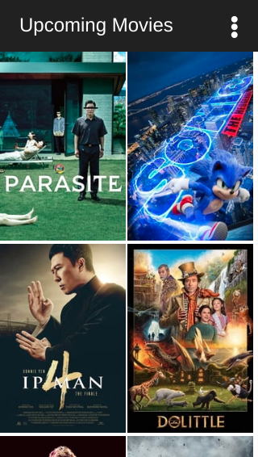
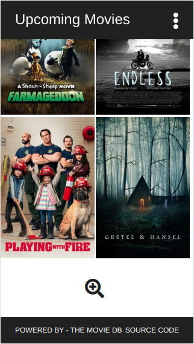
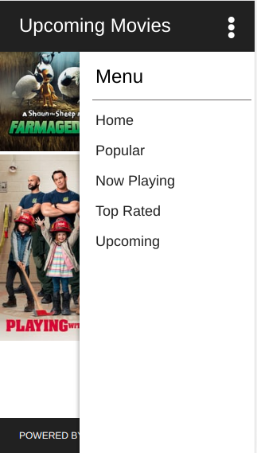
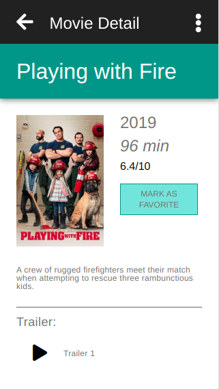
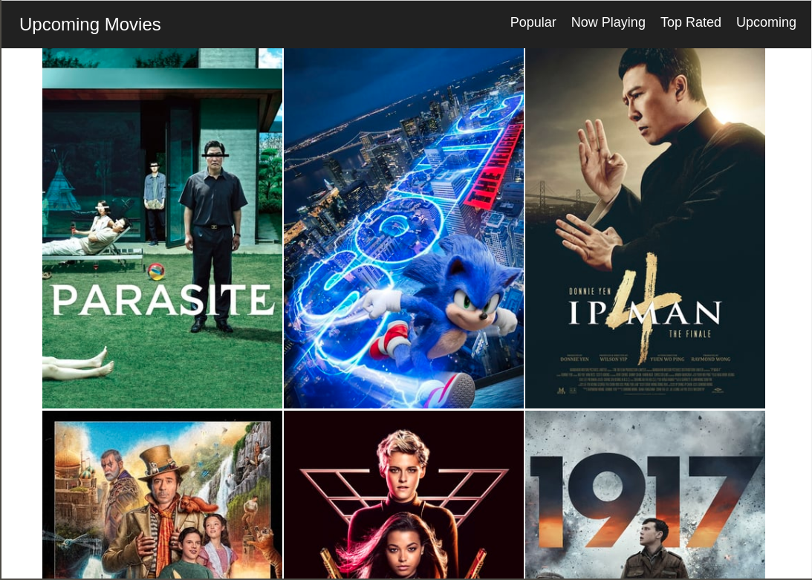
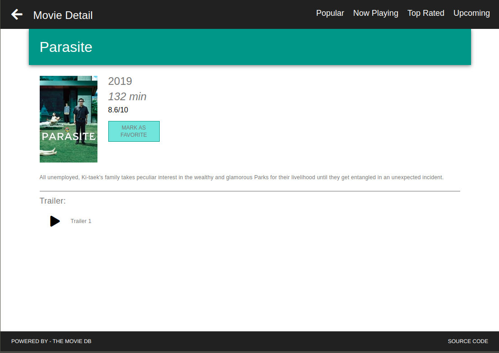

# Movies On Couch

Movies-On-Couch project is a React based project powered by [THE MOVIES DB](https://developers.themoviedb.org/3/getting-started/introduction). Project also leverages the server-side-rendering for best SEO performance.

### Features
```sh
- Server-side Rendering
- React-Router
- SASS support
- Infinite Loading
- Responsive Design
- Font-Awesome Icon Library Support
```

#### Screenshots - Mobile
<kbd></kbd>
<kbd></kbd>
-----------------------------
<kbd></kbd>
<kbd></kbd>
#### Screenshots - Desktop
<kbd></kbd>
-----------------------------
<kbd></kbd>


## Getting Started

### Installing

First clone project and install dependencies

```sh
$ Goto your workspace
$ git clone https://github.com/ajit-mediratta/moviesOnCouch.git
$ cd moviesOnCouch
$ npm install
```


Navigate to [THE MOVIES DB](https://www.themoviedb.org/settings/api) and generate API key.

Goto config.js presetn at root and update value of Key.

```javascript
const config = {
    api: {
        key: '<YOUR_API_KEY_COMES_HERE_AS_STRING>',
        baseUrl: 'https://newsapi.org/v2/top-headlines'
    }
};
```

Run on local

```sh
$ npm run dev
```

##### Open Browser and enter [http://localhost:3000](http://localhost:3000)


```sh
NOTE: My NODE and NPM versions

$ node -v
v8.11.4

$ npm --v
5.6.0
```

